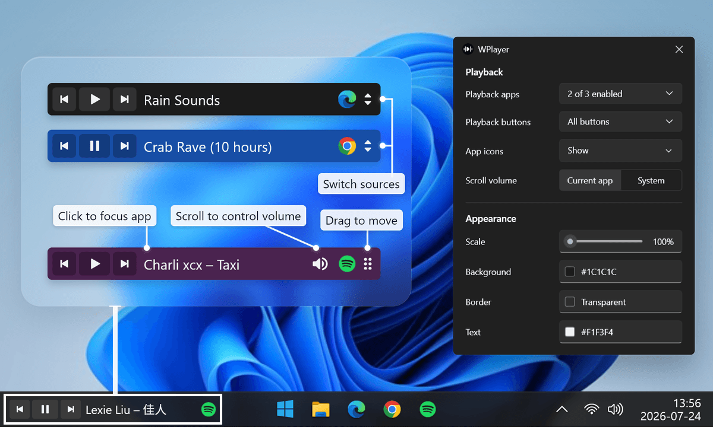

# WPlayer

Small Windows 11 media-session widget. Built with C# and WPF.



## Install

- **[Microsoft Store](https://apps.microsoft.com/detail/9P2KW14109F8)** - recommended.
- **[GitHub Releases](https://github.com/leonbjorklund/wplayer/releases/latest)** - `WPlayer-Setup.exe`. Currently unsigned, Windows might show a warning.

## Controls

- Right-click for settings, dragging, and exit.
- Drag player's right edge to resize.
- Click text area to focus playing app.
- When the play/pause button is hidden, hover the text area and click its play/pause icon.
- Middle-click text area to toggle play or pause.
- Shift + left-click text area for the next track.
- Shift + right-click text area for the previous track.
- Scroll text area to adjust app or system volume.
- Click cycle button to switch playback source.

## Development

```powershell
dotnet run
dotnet build
dotnet test .\WPlayer.Tests\WPlayer.Tests.csproj
```

## Support

Direct installs store settings in `%LOCALAPPDATA%\WPlayer\config.json`; Store installs use Windows-managed app storage.

## License

[MIT](LICENSE)
